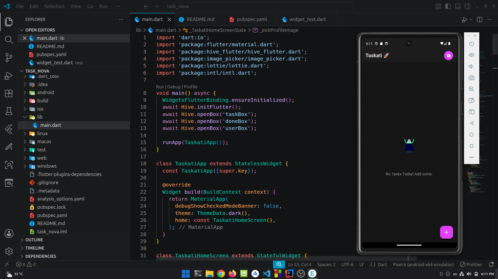
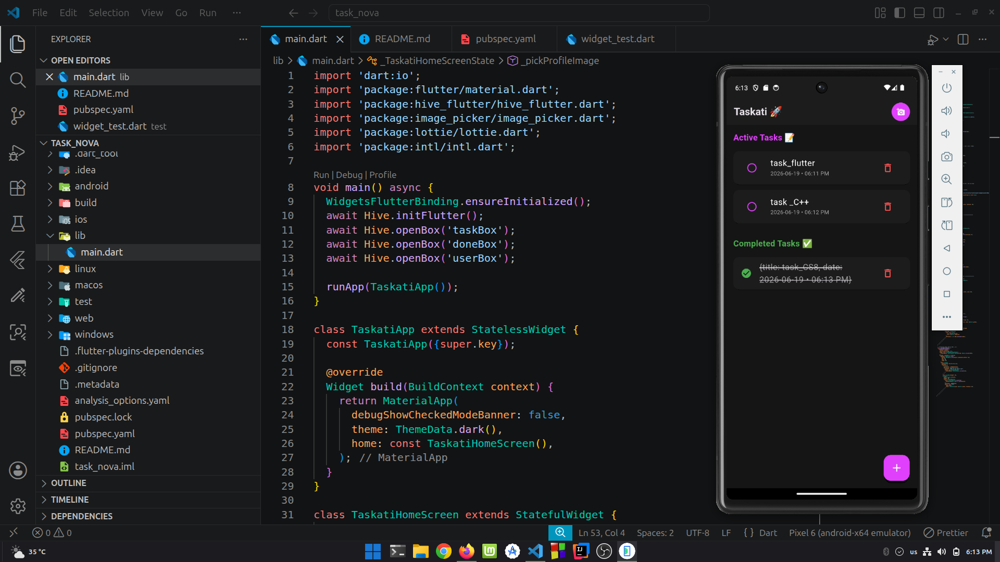

# Taskati 🚀

Taskati is a modern task management application built with Flutter. It allows users to create tasks, track completed tasks, and personalize their profile image with a clean and interactive interface.

## ✨ Features

* Add and delete tasks.
* Mark tasks as completed.
* Display creation date and time for each task.
* Save data locally using Hive.
* Change profile picture using the camera.
* Interactive animations using Lottie.
* Modern dark theme UI.

## 📸 Screenshots

### Home Screen



### Add Task Screen



## 🛠️ Built With

* Flutter
* Dart
* Hive
* Hive Flutter
* Image Picker
* Lottie
* Intl

## 📂 Project Structure

```text
lib/
 ├── main.dart
```

## 🚀 Getting Started

### Clone the repository

```bash
git clone https://github.com/your-username/taskati-flutter.git
```

### Navigate to the project directory

```bash
cd taskati-flutter
```

### Install dependencies

```bash
flutter pub get
```

### Run the application

```bash
flutter run
```

## 👨‍💻 Author

**Montaser Karam**

## 📄 License

This project is developed for educational purposes.
